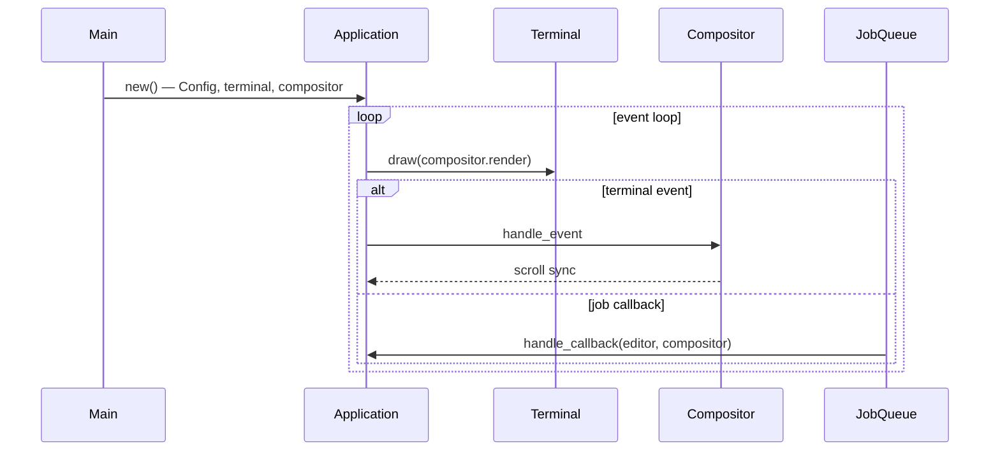

# 005 — app 模块设计

**状态：** 已实现  
**Crate：** `app/`  
**最后更新：** 2026-06-11

---

## 1. 职责与边界

`app` 是 Scribe 的可执行入口，负责：

- 终端生命周期（raw mode、备用屏幕、退出恢复）
- 全局配置初始化（`Config::init_global()`）
- 日志初始化（`infrastructure::init_logger_with_directory`）
- 主事件循环（终端输入 + 异步 Job 回调）
- 持有 `EditorModel` 与 `Compositor` 并协调渲染

**不负责：** UI 组件实现、文档解析、思源 API 调用（分别由 `tui`、`view`、`syservice` 承担）。

---

## 2. 依赖关系

```
app
 ├── tui      (Compositor, JobQueue)
 ├── view     (EditorModel)
 ├── syservice (Config)
 └── infrastructure (logging)
```

外部：`tokio`、`crossterm`、`ratatui`。

---

## 3. 核心类型与文件

| 文件 | 内容 |
|------|------|
| [`app/src/main.rs`](../../app/src/main.rs) | 入口、`restore_tui`、panic hook |
| [`app/src/application.rs`](../../app/src/application.rs) | `Application` 主循环 |

### Application

```rust
pub struct Application {
    terminal: Terminal<CrosstermBackend<io::Stdout>>,
    compositor: Compositor,
    editor_model: EditorModel,
    pub jobs: JobQueue,
}
```

---

## 4. 数据流



1. **启动：** `Config::init_global()` → 日志目录 `../logs` → 进入 alternate screen + raw mode。
2. **每帧：** `render()` 构建 `CompositorContext`（theme、icons、scroll）并调用 `compositor.render`。
3. **输入：** 键盘/Resize 经 `compositor.handle_event`；`Ctrl+C` 触发 `exit_app`。
4. **异步：** `SearchBox` 等在 tokio 中加载文档，经 `JobQueue` 回调更新 `EditorModel` 并 `compositor.pop()`。

---

## 5. 扩展点

| 目标 | 修改位置 |
|------|----------|
| 多笔记 Buffer 切换 | `EditorModel.current_id` + `EditorView` 键盘绑定；`Application` 无需大改 |
| 全局快捷键 | `handle_terminal_events` 或 `Compositor` 顶层分发 |
| 配置文件路径 | 已在 `syservice::Config`，app 仅调用 `init_global` |
| 运行时主题加载 | 在 `render`/`handle_event` 中替换 `Theme::default()` 为可配置实例 |

---

## 6. 已知限制

- 主循环无显式退出条件（除 `Ctrl+C` / panic）。
- `Theme` / `Icons` 每帧 `default()` 重新加载嵌入配置，未缓存。
- Job 回调后依赖下一轮 `render()` 刷新（select 中未强制立即 render）。

---

## 7. 关联文档

- [006 — tui 模块](006-tui-module.md)
- [004 — 项目结构审查](004-project-structure-review.md)
