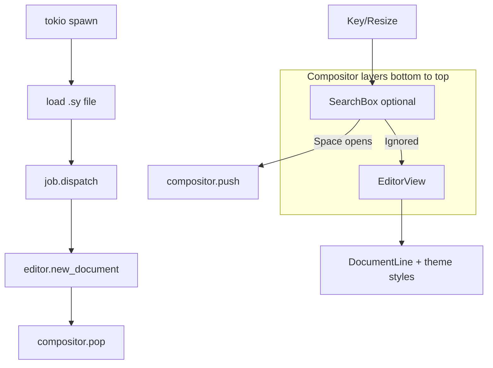

# 006 — tui 模块设计

**状态：** 已实现  
**Crate：** `tui/`  
**最后更新：** 2026-06-11

---

## 1. 职责与边界

`tui` 实现终端 UI 层：

- **Compositor** — 层叠组件、事件自顶向下分发、scroll 持久化
- **EditorView** — 主编辑区：Buffer 栏、Gutter、文档行渲染、状态栏
- **SearchBox** — 搜索输入、异步查询、打开文档
- **主题与图标** — `theme.toml`、`icons.toml` 编译期嵌入

**不负责：** AST 解析与 `DocumentLine` 生成（`view`）；HTTP / 文件 IO（`syservice`）。

---

## 2. 依赖关系

```
tui
 ├── view      (EditorModel, DocumentLine)
 ├── syservice (搜索、load_json_node_from_workspace, Config)
 └── infrastructure (search_box 日志)
```

---

## 3. 核心类型与文件

| 路径 | 职责 |
|------|------|
| [`compositor.rs`](../../tui/src/compositor.rs) | `Compositor`, `CompositorContext`, scroll 辅助方法 |
| [`component/editor.rs`](../../tui/src/component/editor.rs) | `EditorView` 渲染与滚动 |
| [`component/search_box.rs`](../../tui/src/component/search_box.rs) | 搜索 UI + 异步打开文档 |
| [`component/buffer_line.rs`](../../tui/src/component/buffer_line.rs) | 顶部已打开文件标签 |
| [`component/gutter.rs`](../../tui/src/component/gutter.rs) | 行号 + 块图标 |
| [`job.rs`](../../tui/src/job.rs) | `JobQueue`、`dispatch` 跨线程回调 |
| [`uiconfig/theme.rs`](../../tui/src/uiconfig/theme.rs) | 主题解析 |
| [`uiconfig/icons.rs`](../../tui/src/uiconfig/icons.rs) | Gutter 图标映射 |

### Component trait

```rust
pub trait Component {
    fn render(&mut self, f: &mut Frame, area: Rect, cx: &mut CompositorContext);
    fn handle_event(&mut self, event: &Event, cx: &mut CompositorContext) -> EventResult;
    fn cursor_position(&self, area: Rect) -> Option<(u16, u16)>;
}
```

---

## 4. 数据流



**打开文档：** `Space` → push `SearchBox` → 输入 → debounce 搜索 → `Enter` → tokio 读 `.sy` → `dispatch` 回调 `new_document` + `scroll=0` + pop SearchBox。

**渲染：** `EditorView` 按 `scroll` 截取 `DocumentLine`，合并 `InLineItem.styles` 与 `theme.get()`。

---

## 5. 扩展点

| 目标 | 建议改动 |
|------|----------|
| **多笔记切换** | Buffer 栏点击/快捷键切换 `EditorModel.current_id`；恢复每文档 scroll（见 view `ViewPosition`） |
| Buffer 关闭标签 | `EditorModel` 增加 `close_document`；Buffer 栏渲染关闭 affordance |
| 代码块主题 | `CompositorContext` 传入 `Theme` 至 view 解析路径，或 render 时注入 |
| 运行时 theme | 替换 `Theme::default()` 为从文件加载 + 热重载 |
| 编辑模式光标 | 实现 `EditorView::cursor_position` + `Compositor::cursor_position` |

---

## 6. 已知限制

- 仅 `EditorView` 为默认底层；无独立 Status 组件（状态栏内联在 editor）。
- SearchBox 打开时使用 `content_area.width` 作为文档宽度，可能与 resize 后不一致直至 redraw。
- 多层 overlay 时底层每帧仍全量 render（无脏区优化）。

---

## 7. 关联 backlog（来自 004）

- 代码块 `get_code_block_style` 仍可能未完全接入 theme HashMap
- `cursor_position` 阅读模式返回 `None`（ intentional ）

---

## 8. 关联文档

- [007 — view 模块](007-view-module.md)
- [001 — 代码块渲染](001-code-block-rendering.md)
- [THEME.md](../../THEME.md)
