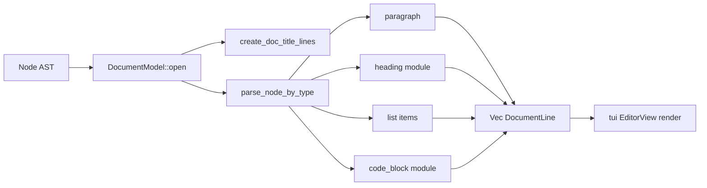

# 007 — view 模块设计

**状态：** 已实现  
**Crate：** `view/`  
**最后更新：** 2026-06-11

---

## 1. 职责与边界

`view` 是**与终端无关**的文档视图层：

- 将思源 Lute `Node` AST 转为可渲染的 `DocumentModel` / `DocumentLine`
- 块级布局：段落换行、列表、标题装饰、代码块边框
- 行内样式解析（`InlineMarks` → `theme.toml` 样式键）
- 编辑器状态：`EditorModel`、多文档 `BTreeMap`

**不负责：** Ratatui 绘制、crossterm 输入、HTTP（由 `tui` / `syservice` 负责）。

---

## 2. 依赖关系

```
view
 └── syservice (Node, NodeType — lute)
```

`ratatui` 仅部分类型用于 layout 测试（dev-dependencies）。

---

## 3. 核心类型与文件

| 模块 | 职责 |
|------|------|
| [`document.rs`](../../view/src/document.rs) | `DocumentModel`, `DocumentLine`, `InLineItem`, AST → lines |
| [`editor.rs`](../../view/src/editor.rs) | `EditorModel`, `new_document`, buffer 标签查询 |
| [`heading/`](../../view/src/heading/) | H1–H6 装饰线与样式键 |
| [`code_block/`](../../view/src/code_block/) | 代码块解析、布局、渲染为 `InLineItem` |
| [`styles.rs`](../../view/src/styles.rs) | `parse_marks`, 复合行内 mark |
| [`utils.rs`](../../view/src/utils.rs) | 行宽计算、软换行 |

### DocumentLine 元数据

```rust
pub struct DocumentLine {
    pub content: Vec<InLineItem>,
    pub block_start: bool,      // Gutter 图标首行
    pub heading_level: Option<u8>,
    // node_type, indent_width — 内部
}
```

### 解析入口

```rust
DocumentModel::open(node, id, line_len, source_label) -> DocumentModel
  → parse_ast_root_node
  → parse_node_by_type (per child block)
```

---

## 4. 数据流



**宽度：** `max_line_len` 来自终端 content 区宽度；`resize` 时 `parse_ast_root_node` 重新计算。

**Gutter 图标：** 仅 `block_start=true` 且类型为 `NodeDocument` / `NodeHeading` / 多行 `NodeCodeBlock` 时在 tui 显示图标。

---

## 5. 扩展点

| 目标 | 改动 |
|------|------|
| 多笔记 | `EditorModel` 已有多 doc；需 per-doc scroll 存 `ViewPosition` |
| 引用块 / 表格 | `parse_node_by_type` 增加分支 + theme 键 |
| 代码块主题 | `create_code_block_lines` 传入 `Theme.styles` 而非空 HashMap |
| 列表有序/任务图标 | `list_data` 驱动 gutter / 样式 |
| 嵌入块查询 | `parse_node_by_type` TODO：缩进与 block_ref |

---

## 6. 已知限制

- 根节点 `Node` 在 `parse_ast_root_node` 中被 `take()`，resize 依赖保留的 re-parse 逻辑或 `need_redraw` 路径。
- 列表多级缩进未完整实现。
- `ViewPosition` 字段尚未用于 scroll 持久化。

---

## 7. 关联文档

- [001 — 代码块渲染](001-code-block-rendering.md)
- [002 — 行内样式](002-inline-styles.md)
- [006 — tui 模块](006-tui-module.md)
