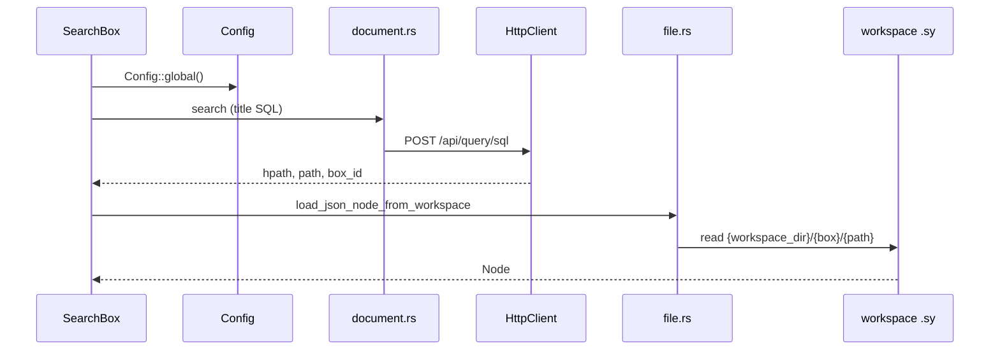

# 008 — syservice 模块设计

**状态：** 已实现  
**Crate：** `syservice/`  
**最后更新：** 2026-06-11

---

## 1. 职责与边界

`syservice` 封装与思源笔记的集成：

- **配置** — 从用户目录 `config.toml` 加载（非环境变量优先）
- **HTTP 客户端** — `HttpClient` + `SiYuanClient` trait + 中间件
- **文档搜索** — SQL/API 查询标题与路径
- **工作空间文件** — 读取 `.sy` JSON，解析为 Lute `Node`
- **领域类型** — `SyBlock`, `SyResponse`

**不负责：** TUI 渲染、终端事件。

---

## 2. 依赖关系

```
syservice
 └── infrastructure (config 加载日志)
```

被 `app`、`tui`、`view` 依赖。`view` 仅使用 `lute::node`。

---

## 3. 核心类型与文件

| 模块 | 职责 |
|------|------|
| [`config.rs`](../../syservice/src/config.rs) | `Config`, `Config::global()`, 路径探测 |
| [`client.rs`](../../syservice/src/client.rs) | `HttpClient`, 重试、Authorization |
| [`api.rs`](../../syservice/src/api.rs) | `SiYuanClient`, `Middleware`, `Logger` traits |
| [`document.rs`](../../syservice/src/document.rs) | `search_doc_with_title` 等 |
| [`file.rs`](../../syservice/src/file.rs) | `load_json_node_from_workspace` |
| [`domain.rs`](../../syservice/src/domain.rs) | API 响应结构 |
| [`lute/`](../../syservice/src/lute/) | `.sy` → `Node` AST |

### Config 字段

```rust
pub struct Config {
    pub base_url: String,
    pub token: String,
    pub timeout_secs: u64,
    pub workspace_dir: Option<String>,
}
```

配置文件路径（按序探测）：

- Linux: `~/.config/scribe/config.toml`
- macOS: `~/Library/Application Support/scribe/config.toml`

---

## 4. 数据流



**路径拼接：** `workspace_dir` + `notebooks/{box_id}/{relative_path}`（见 `file.rs`）。

---

## 5. 扩展点

| 目标 | 改动 |
|------|------|
| 笔记本白名单 | 见 [010 — 笔记本访问控制](010-notebook-access-control.md)（规划中） |
| 统一 HTTP | `search_doc_with_title` 迁到 `HttpClient`，消除裸 reqwest |
| SQL 安全 | 参数化查询，避免字符串拼接 |
| 环境变量覆盖 | 可选实现 `SIYUAN_*` 与文档对齐 |
| 缓存 | 对 `.sy` 解析结果或搜索 debounce 结果做 LRU |

---

## 6. 已知限制

- `search_doc_with_title` 部分仍直接使用 reqwest，存在 SQL 拼接风险（004 P1）。
- 无 `[[notebooks]]` 多笔记本配置（010 规划）。
- `init-config.sh` 与 Config 字段需保持同步（仅四字段有效）。

---

## 7. 用户文档

- [syservice/CONFIG.md](../../syservice/CONFIG.md) — 配置说明
- [syservice/EXTENSIBILITY_GUIDE.md](../../syservice/EXTENSIBILITY_GUIDE.md) — Trait 扩展
- [003 — 配置系统](003-config-system.md)

---

## 8. 关联文档

- [003 — 配置系统](003-config-system.md)
- [010 — 笔记本访问控制](010-notebook-access-control.md)
