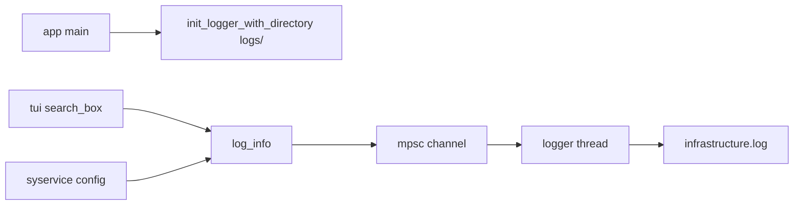

# 009 — infrastructure 模块设计

**状态：** 已实现  
**Crate：** `infrastructure/`  
**最后更新：** 2026-06-11

---

## 1. 职责与边界

`infrastructure` 提供跨 crate 的**基础设施能力**，当前仅包含：

- 异步文件日志（单后台线程 + mpsc 队列）
- 统一日志 API：`log_info`, `log_warn`, `log_error`, `log_debug`

**原则：** 无业务逻辑、不依赖 `tui` / `view` / `syservice` 上层 crate。

---

## 2. 依赖关系

```
infrastructure
 └── chrono, std only
```

被 `app`（初始化）、`syservice`（config 日志）、`tui`（search_box 流程日志）使用。

---

## 3. 核心 API

| 函数 | 说明 |
|------|------|
| `init_logger_with_directory(path)` | 指定日志目录，写入 `{path}/infrastructure.log` |
| `log_info(scope, message)` | 异步投递 Info 级别 |
| `log_warn` / `log_error` / `log_debug` | 其他级别 |

### 实现要点

- `LOG_SENDER: OnceLock<Sender<LoggerCommand>>` — 全局单例，首次初始化生效
- 后台线程名：`infrastructure-logger`
- 单文件超过 **10MB** 自动截断
- 未调用 `init_logger_with_directory` 时，日志落 **stdout/stderr**

---

## 4. 数据流



---

## 5. 扩展点

| 目标 | 建议 |
|------|------|
| 日志级别过滤 | `init` 时传入 min level |
| 多文件按 scope 分片 | 扩展 `LogEvent` 路由 |
| 结构化日志 | JSON 行格式可选 |
| 敏感信息 | 避免在 message 中记录 token、完整 hpath（见 config/search 调用方） |

---

## 6. 已知限制

- 初始化不可重复配置目录（OnceLock）。
- 无 log rotation 归档，仅截断。
- 生产路径过滤需在各调用方自行避免敏感字段。

---

## 7. 关联文档

- [005 — app 模块](005-app-module.md)
- [003 — 配置系统](003-config-system.md)
